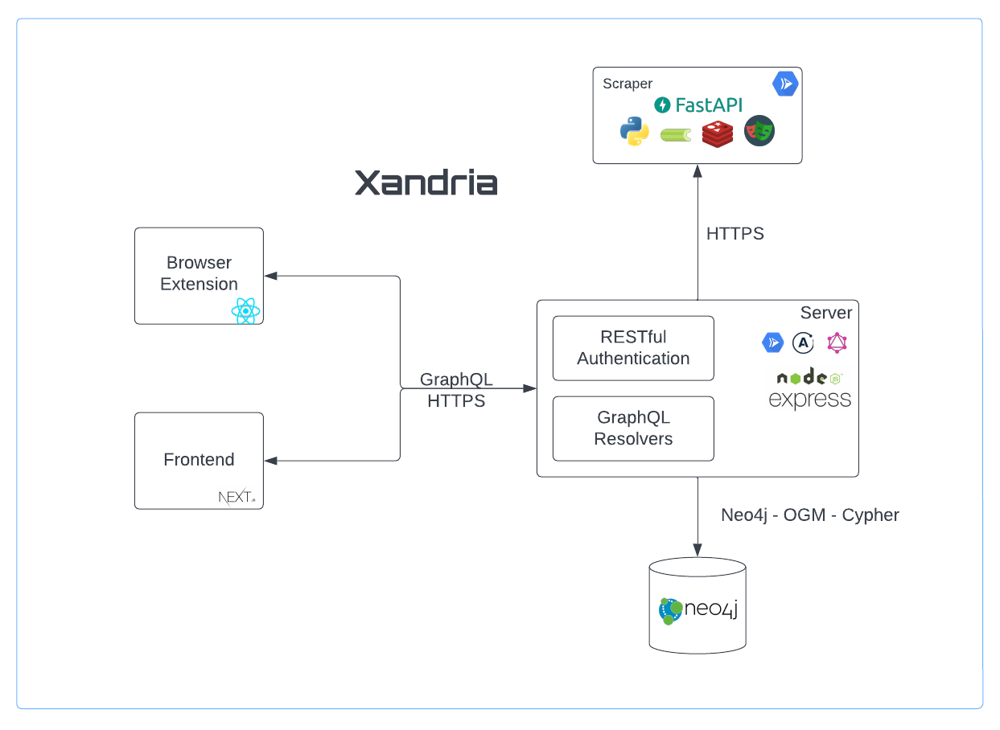

# Xandria Distributed Scraper

The system covered in this repositry is with regards to the scraper component of Xandria.



## Installation

Install requirements:

```bash
pip3 install -r requirements.txt
```

## Execute

Run:

```bash
celery -A tasks worker
```

```bash
uvicorn main:app --reload
```


Visit: [http://localhost:8000/](http://localhost:8000/)